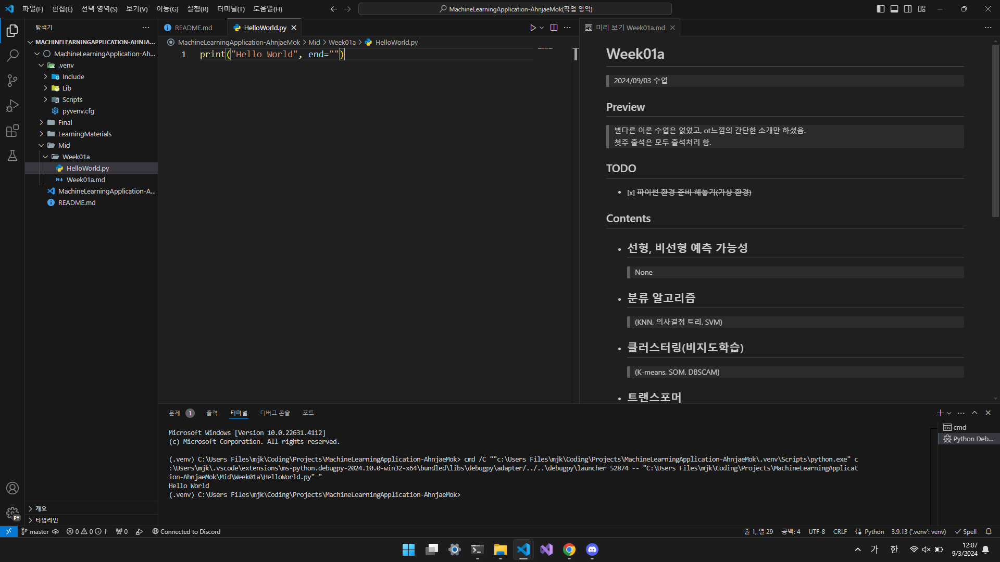

# 💻 MachineLearningApplication-JaemokAhn

## Preview



## Introduction

> 2024년 2학기 머신러닝응용[01]

## Evaluation method

> 과제 20%  
> 중간 30%  
> 기말 30%  
> 실습 20%  

- 시험에 코드를 작성하는 문제가 나올수 있음
- 파이썬 언어 기반수업
- 주피터 노트북/스파이더
- 텐서플로우
- 사이킷런
- 교재 : [Machine_Learning_with_TensorFlow_Second.pdf](./LearningMaterials/Machine_Learning_with_TensorFlow_Second.pdf)
    > 책에 적힌 코드가 텐서플로우 1.0 기반의 코드라 2.0 코드로 변환해야 함.
- 수업 수강 인원 29명

## Note

- ## pip 모듈 관리 명령어

    > python version : ~~3.7.4~~ -> 3.8.6  
    ```cmd
    pip freeze > requirements.txt
    pip install -r requirements.txt
    ```
    ```cmd
    pip install ipykernel
    pip install tensorflow
    pip install numpy
    pip install matplotlib
    pip install librosa
    pip install minisom
    pip install pandas
    pip install scikit-learn
    pip install seaborn
    ```
