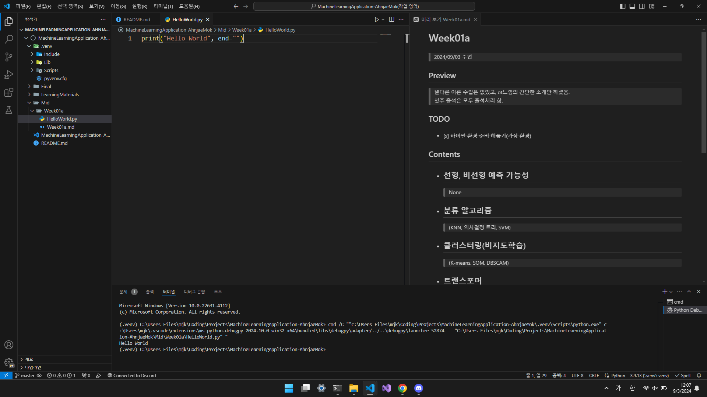

# 💻 MachineLearningApplication-JaemokAhn

## Preview

## Introduction

> 2024년 2학기 머신러닝응용[01]

## Evaluation method

> 과제 20%  
> 중간 30%  
> 기말 30%  
> 실습 20%  

- 시험에 코드를 작성하는 문제가 나올수 있음
- 파이썬 언어 기반수업
- 주피터 노트북/스파이더
- 텐서플로우
- 사이킷런
- 교재 : [Machine_Learning_with_TensorFlow_Second.pdf](./LearningMaterials/Machine_Learning_with_TensorFlow_Second.pdf)
    > 책에 적힌 코드가 텐서플로우 1.0 기반의 코드라 2.0 코드로 변환해야 함.
- 수업 수강 인원 29명

## Note

**pip freeze > requirements.txt**